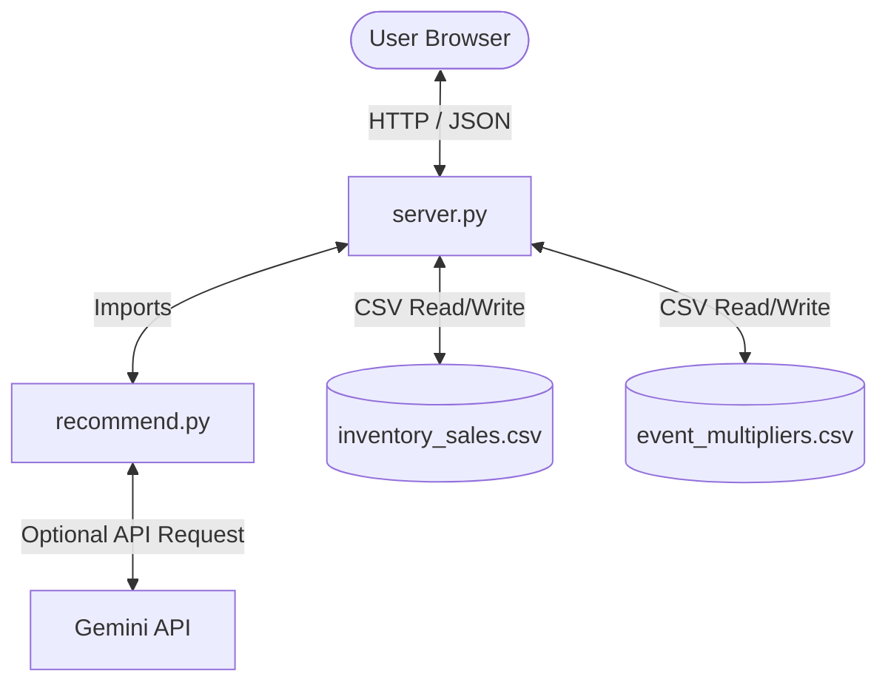

# AMIPI Inventory Recommendation & Restocking Tool
### Project 3 — Event-Aware Restocking for Fine Jewelry

A high-performance decision-support dashboard and calculation engine that recommends restocking quantities for fine jewelry inventory ahead of major trade shows and holiday events. 

The application utilizes a **hybrid architecture**:
- **Deterministic Business Rules**: All quantitative mathematics, inventory availabilities, and restocking priority categories are calculated using strict, deterministic algorithms to ensure absolute accounting precision.
- **Generative AI (Google Gemini 2.5 Flash)**: On page load, the tool securely calls the Gemini API server-side using environment keys to generate professional, natural-language retail merchandising rationales for each restocking recommendation.

---

## Architecture Overview



---

## AI vs. Deterministic Logic

To ensure business reliability, AI is strictly separated from decision-making metrics. No inventory quantities, purchase orders, or priority assignments are determined by AI.

| Component | Logic Type | Method / Description |
|-----------|------------|----------------------|
| **Available Inventory** | Deterministic | `Current Stock` + `On Order` (Standard balance sheet arithmetic). |
| **Monthly Sales Rate** | Deterministic | `Last 90-Day Sales` / 3. |
| **Projected Demand** | Deterministic | `Monthly Sales Rate` × (`Days Until Event` / 30). |
| **Recommended Stock Needed** | Deterministic | `Projected Demand` × `Event Multiplier`. |
| **Suggested Order Qty** | Deterministic | `max(0, round(Recommended Stock Needed - Available Inventory))`. |
| **Urgency/Priority Category** | Deterministic | Rule-based decision table mapping sales velocity and stock levels. |
| **Recommendation Action** | Deterministic | Maps directly from the priority category (Hold, Monitor, Reorder, Reorder Urgently). |
| **Business Rationale** | **AI (Gemini)** | Prompts Gemini 2.5 Flash with the calculated metrics, metals (e.g., 18K white gold, platinum), and stone specifications to produce a concise retail merchandising justification. |

---

## Setup & Running the Dashboard

### Requirements
- **Python 3.9+**
- **pip** (Python package installer)

### Installation
1. Clone or unzip the project directory.
2. Install the required dependencies:
   ```bash
   pip install pandas requests
   ```

### Running the Web Server
Set your Gemini API key in your environment and start the server:

**On Windows (PowerShell):**
```powershell
$env:GEMINI_API_KEY="your-api-key-here"
$env:PYTHONIOENCODING="utf-8"
python server.py
```

**On macOS/Linux:**
```bash
export GEMINI_API_KEY="your-api-key-here"
python server.py
```

Live URL(Deployed on Render): **(https://amipi-inventory-recommendation-tool.onrender.com/))](https://amipi-inventory-recommendation-tool.onrender.com/)**

---

## Command Line Usage

You can also run the core calculation engine directly from the CLI:

```bash
# Run all items using the environment's Gemini API Key
python recommend.py

# Filter results by a specific event
python recommend.py --event "JCK Vegas"

# Look up a specific style code
python recommend.py --style LB888222-18WVS

# Run calculations using local deterministic fallback templates instead of the API
python recommend.py --no-ai

# Export results to outputs/ directory
python recommend.py --output csv
python recommend.py --output json
```

---

## Sample Outputs

### Sample 1: CLI Single Style Lookup (`LB888222-18WVS`)
```text
  ▸ LB888222-18WVS  [Reorder Urgently]  Priority: High
    Category: Ring  |  Metal: 18W  |  Stone: Lab Grown Diamond
    Event: JCK Vegas in 35 days  |  Multiplier: 2.0×
    90-day sales: 30  |  In stock: 2  |  On order: 6  |  Available: 8
    Monthly rate: 10.0  |  Projected demand: 11.67  |  Needed: 23.33
    ➜ Order qty: 15  |  Strong turn rate for this 18K white gold lab-grown diamond ring requires an immediate restock of 15 units to avoid showcase stockouts at JCK Vegas.
```

### Sample 2: CLI Event Filter Summary (`JCK Vegas`)
```text
🔷 AMIPI Inventory Recommendation Tool
  Loading data …
  Processing 7 item(s) …

============================================================
  ▸ B401400-14WVS  [Reorder]  Priority: Medium
    ...
    ➜ Order qty: 8  |  Replenish 8 units of this 14K white gold band to maintain core collection presentation depth for JCK Vegas.

  ▸ LB401400-14WVS  [Reorder Urgently]  Priority: High
    ...
    ➜ Order qty: 8  |  High turn rate of 14K white gold bands justifies immediate restocking of 8 units to maximize JCK Vegas sell-through.

  ▸ B501200-18YRA  [Monitor]  Priority: Low
    ...
    ➜ Order qty: 0  |  Sufficient showcase depth (5 units on-hand) for this 18K yellow gold ruby band; monitor sales approaching JCK Vegas.

============================================================
  SUMMARY
============================================================
  High                           4 item(s)
  Medium                         2 item(s)
  Low                            1 item(s)
  Do Not Reorder                 0 item(s)
  Total units to order:          21
============================================================
```

### Sample 3: API JSON Calculation Response (`POST /api/calculate`)
```json
[
  {
    "style_number": "B601800-14REM",
    "category": "Ring",
    "metal": "14R",
    "stone_type": "Emerald and Diamond",
    "event": "Mother's Day",
    "days_until_event": 25,
    "available_inventory": 3,
    "current_stock": 1,
    "on_order": 2,
    "last_90_day_sales": 9,
    "monthly_sales_rate": 3.0,
    "projected_demand_until_event": 2.5,
    "event_multiplier": 1.8,
    "recommended_stock_needed": 4.5,
    "suggested_order_qty": 2,
    "priority": "Medium",
    "recommendation": "Reorder",
    "reason": "Emerald and diamond ring inventory is thin; order 2 units to support showcase presentation depth for Mother's Day."
  }
]
```

---

## Validation & Graceful Error Handling

The application contains strict input validation checks across all layers (CLI, Server API, and Browser UI) to ensure the system is crash-proof:

| Scenario / Error Type | Layer | Validation Check | Graceful Behavior & Message |
|-----------------------|-------|------------------|-----------------------------|
| **Missing CSV files** | Core | Checks if data files exist on startup. | Exits CLI/Server with: `FileNotFoundError: Inventory file not found: ...` |
| **Malformed CSV columns** | Core | Verifies required headers exist. | Exits with: `ValueError: Inventory CSV is missing columns: {...}` |
| **Non-numeric CSV cells** | Core | Coerces cells via `pd.to_numeric()`. | Skips row, logs terminal warning: `⚠ Warning: X row(s) have non-numeric '...', will be skipped.` |
| **Invalid Client Payload** | Server | Verifies calculation list schema on POST. | Returns HTTP `400 Bad Request` with: `{"error": "Payload inventory missing required columns: [...]"}` |
| **Empty Inventory Save** | Server | Checks if save payload contains style keys. | Returns HTTP `400 Bad Request` with: `{"error": "Inventory payload is empty or missing 'style_number'"}` |
| **Invalid Editable Cell Input** | Web UI | Checks if updated cell values are non-negative. | Displays warning toast: `Invalid input for [Field]. Must be a non-negative integer.`, and resets value to `0`. |
| **Duplicate Style Code** | Web UI | Checks if added style code already exists. | Rejects modal submission, shows toast: `Style number [Code] already exists!` |
| **Gemini API Down / Offline** | Network | Wraps POST in timeout and try/catch. | Logs warning to terminal and seamlessly falls back to the deterministic, high-quality retail reason templates without interrupting the user. |
